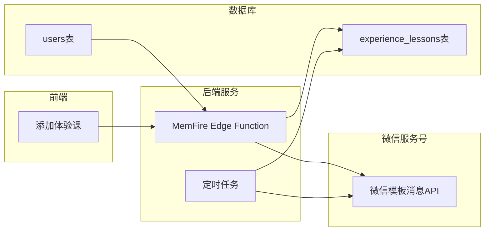

# 微信消息通知教练方案

## 整体架构




## 实现步骤

### 第一步：微信服务号配置（微信公众平台操作）

1. 登录 [微信公众平台](https://mp.weixin.qq.com/)
2. 获取 AppID 和 AppSecret（设置 -> 开发设置）
3. 配置服务器地址（用于接收用户关注事件）
4. 创建消息模板：

- **体验课通知模板**：包含学员姓名、上课时间、班级等字段
- **课前提醒模板**：包含课程信息、开始时间

### 第二步：数据库调整

在 `users` 表添加微信 OpenID 字段：

```sql
ALTER TABLE "users" ADD COLUMN IF NOT EXISTS "wechatOpenId" VARCHAR(100);
CREATE INDEX IF NOT EXISTS "users_wechatOpenId_idx" ON "users"("wechatOpenId");
```


### 第三步：创建 MemFire Edge Function 发送消息

创建 Edge Function 处理微信消息发送：

```typescript
// supabase/functions/send-wechat-notification/index.ts
import { serve } from 'https://deno.land/std@0.168.0/http/server.ts'

serve(async (req) => {
  const { teacherId, templateId, data } = await req.json()
  
  // 1. 获取教练的 wechatOpenId
  // 2. 获取微信 access_token
  // 3. 调用微信模板消息 API
  
  const response = await fetch(
    `https://api.weixin.qq.com/cgi-bin/message/template/send?access_token=${accessToken}`,
    {
      method: 'POST',
      body: JSON.stringify({
        touser: openId,
        template_id: templateId,
        data: data
      })
    }
  )
  
  return new Response(JSON.stringify({ success: true }))
})
```


### 第四步：前端添加体验课后触发通知

修改 [`frontend/src/services/memfireDB.ts`](frontend/src/services/memfireDB.ts) 的 `experienceLessonsDB.create` 方法：

```typescript
async create(data: {...}) {
  // 现有创建逻辑...
  const { data: newLesson, error } = await memfire.from('experience_lessons').insert(...);
  
  // 新增：发送微信通知
  if (newLesson && data.teachingTeacherId) {
    await memfire.functions.invoke('send-wechat-notification', {
      body: {
        teacherId: data.teachingTeacherId,
        templateId: 'YOUR_TEMPLATE_ID',
        data: {
          studentName: { value: data.studentName },
          scheduleDate: { value: data.scheduleDate },
          className: { value: data.className },
          // ...
        }
      }
    });
  }
  
  return newLesson;
}
```


### 第五步：课前提醒定时任务

使用 MemFire 的 pg_cron 或外部定时服务：

```sql
-- 创建定时任务，每小时检查即将开课的体验课
SELECT cron.schedule(
  'lesson-reminder',
  '0 * * * *',  -- 每小时执行
  $$
    SELECT send_lesson_reminder()
  $$
);
```


### 第六步：教练绑定微信

需要实现一个流程让教练绑定微信：

1. 教练扫描服务号二维码关注
2. 系统获取其 OpenID
3. 教练在系统内绑定（输入验证码或扫码确认）

## 需要您提供的信息

1. 微信服务号的 **AppID** 和 **AppSecret**
2. 已创建的 **消息模板ID**
3. 课前提醒的时间（提前多久提醒，如1小时/1天）

## 预估工作量

| 任务 | 时间 ||------|------|| 数据库调整 | 5分钟 || Edge Function 开发 | 30分钟 || 前端集成 | 15分钟 || 定时任务配置 | 20分钟 |